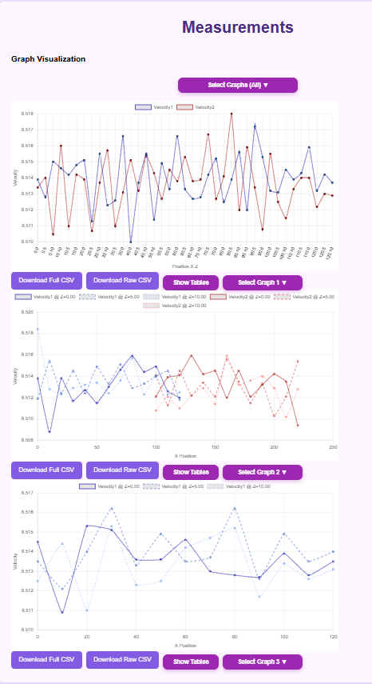

<h1>HotWire Web-Based Motor Control (Research Collaboration)</h1>

<h2>Description</h2>
A Flask-based data acquisition and visualization system developed in collaboration with the W.M. Keck Center for 3D Innovation.
This platform supports real-time flow measurement in metal 3D-printing chambers through a custom Python backend for motor control, sensor acquisition, and automated data processing.

Note: Only selected non-proprietary images from my personal contributions are included for demonstration. The full system and hardware integration remain property of the research center.

## Interface Screenshots

### Main Interface
<table>
<tr>
<td width="50%" align="center">

 
<em>Primary control interface for motor control and data acquisition</em>
</td>
<td width="50%" align="center">

 
<em>Additional controls and real-time monitoring features</em>
</td>
</tr>
</table>

### Data Visualization
<table>
<tr>
<td width="50%" align="center">

 
<em>Interactive graph interface for comparing flow measurements</em>
</td>
<td width="50%" align="center">

 
<em>Data collection and storage management dashboard</em>
</td>
</tr>
</table>

## Features:
- Flask-driven backend for coordinated sensor control and experiment execution
- Motor jog interface with adjustable pulse-based movements and positional feedback
- Real-Time Graph Generation: Displays sensor data dynamically
- Automated test runner for sequential probe scans, voltage sampling, and velocity calculation
- Structured database layer (SQLite) for persistent storage of voltage, velocity, and positional data
- CSV generation pipeline for exporting raw and processed datasets with constant tracking
- Dynamic front-end dashboard displaying live velocity and position charts via Chart.js and Flask templating

## Project Context
This software formed part of a gas-flow characterization project used to study fluid behavior inside Laser Powder Bed Fusion (LPBF) systems.
It was designed to:

-Automate hot-wire anemometry tests.

-Log sensor and positional data for chamber mapping.

-Provide a web-based interface for experiment visualization and replay.

# Technologies

- Flask
- SQLite3 / Pandas
- Chart.js + JavaScript
- NumPy / statistics
- HTML / Jinja

# My contributions focused on:

-Developing data collection routes (Flas, SQL)
-Motor control logic (Python)
-Data processing (Python)
-Database management and interfacing (HTML, SQL)
-Static and real time data visualization (JavaScript)
-CSV-based data processing and organization (Python)

# Research Impact

This software enabled:

-Consistent data collection across multiple LPBF systems.

-Visualization of gas flow distributions via dual-probe hot-wire sensors.

-Scalable experiment logging for parameter optimization.

-The resulting workflows were used in ongoing LPBF chamber optimization and validation studies.

# Notes

-Features shown here represent my authored components only for portfolio use.
-Modules, datasets, and configurations are withheld under institutional research agreements.
-The full project integrates with embedded controllers and a distributed data pipeline.

#Notes

-Features shown here represent my authored components only for portfolio use.
-Modules, datasets, and configurations are withheld under institutional research agreements.
-The full project integrates with embedded controllers and a distributed data pipeline.
